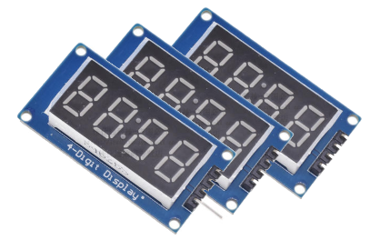
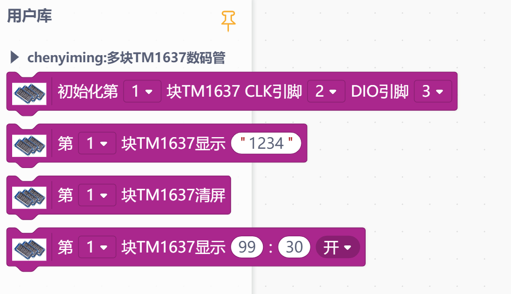
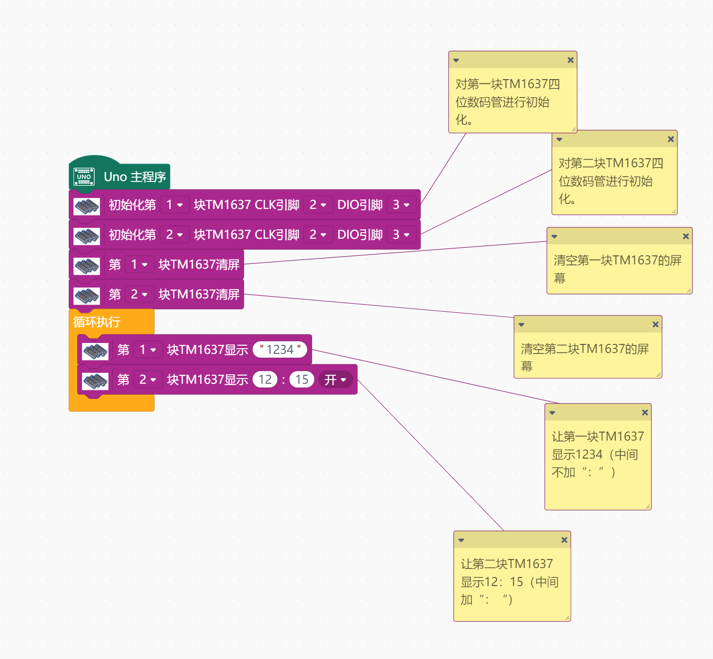

# 多个TM1637数码管




---------------------------------------------------------

## 目录

* [相关链接](#相关链接)
* [描述](#描述)
* [积木列表](#积木列表)
* [示例程序](#示例程序)
* [许可证](#许可证)
* [支持列表](#支持列表)
* [更新记录](#更新记录)

## 相关链接
* 本项目加载链接: ```https://github.com/Kimicym/TM1637.git```

* 用户库教程链接: ```https://mindplus.dfrobot.com.cn/extensions-user```

* 购买此产品: [淘宝](https://www.taobao.com/).

## 描述
TM1637是一块可以显示数字的4位数码管。这个模块可以同时控制多块TM1637。

## 积木列表




## 示例程序



## 许可证

MIT

## 支持列表

主板型号                | 实时模式    | ArduinoC   | MicroPython    | 备注
------------------ | :----------: | :----------: | :---------: | -----
micro:bit        |             |       X       |             | 
mpython        |             |        X      |             | 
Arduino        |             |        √      |             | 

## 更新日志
* V0.0.1  时间：04/29/2021. 基础功能完成
* V0.0.2  时间：05/01/2021. 改进显示时钟范围